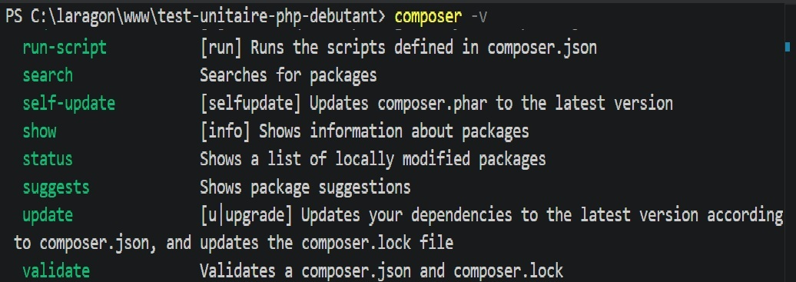
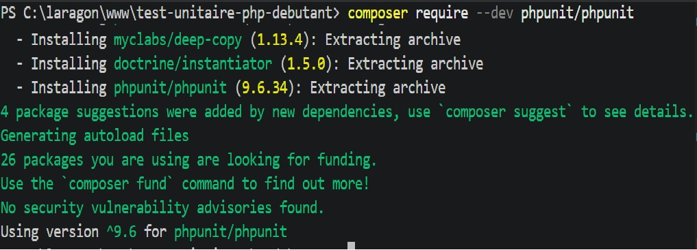
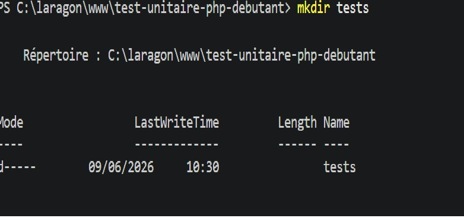
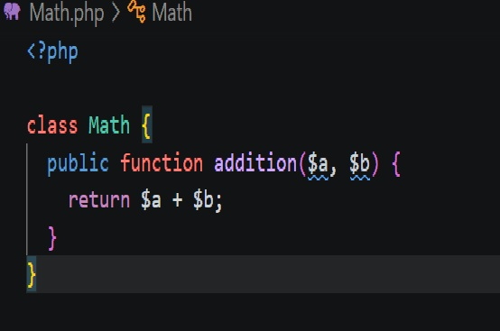
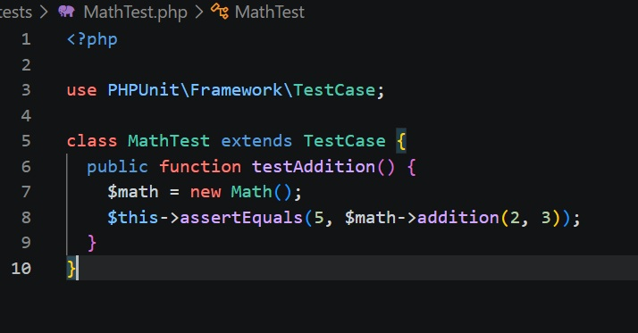
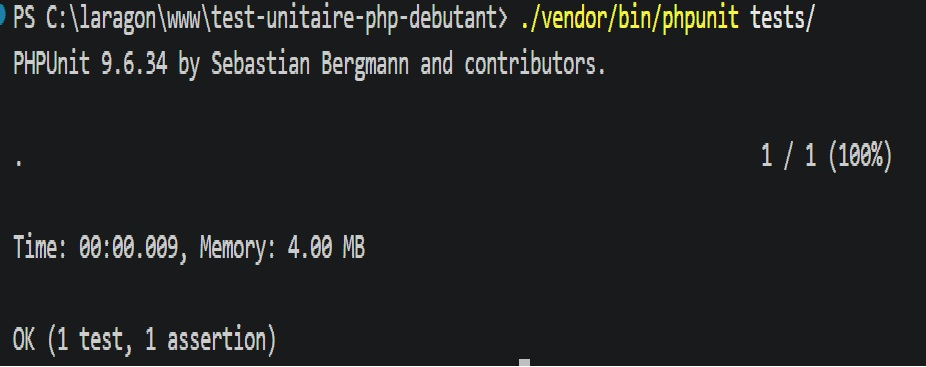
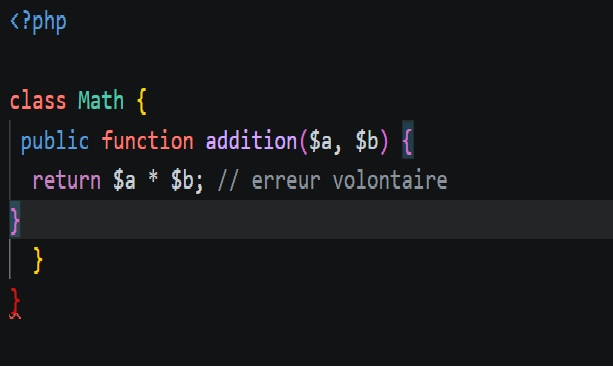
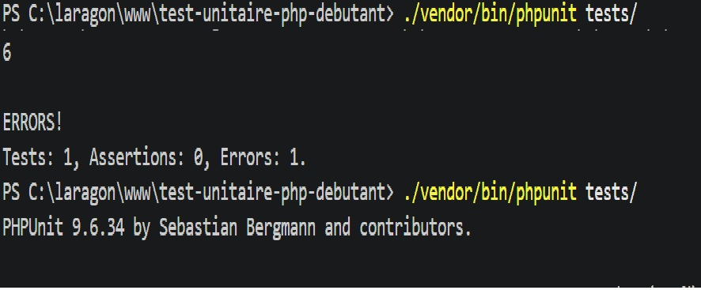
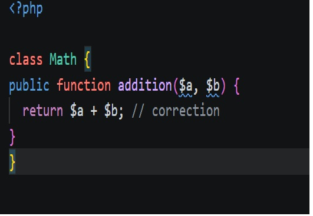
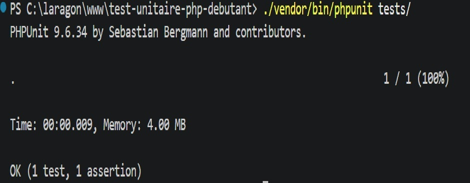

 Jour 2 - Job 02 - Test Unitaire avec PHPUnit

 1: Initialiser Composer
Commande pour créer le fichier `composer.json` :

composer init --no-interaction

 2: Installer PHPUnit

composer require --dev phpunit/phpunit

 3: Créer les dossiers src/ et tests/

mkdir src
mkdir tests

4: Créer la classe Math.php
Classe PHP avec la méthode addition :

 5: Créer le fichier MathTest.php
Fichier de test avec PHPUnit :

 6: Lancer les tests - succès

./vendor/bin/phpunit tests/

7: Erreur volontaire
Modification du `+` en `*` dans Math.php :

8: Tests en échec

9: Correction du bug
Remise du `+` dans Math.php :

10: Tests finaux - succès
